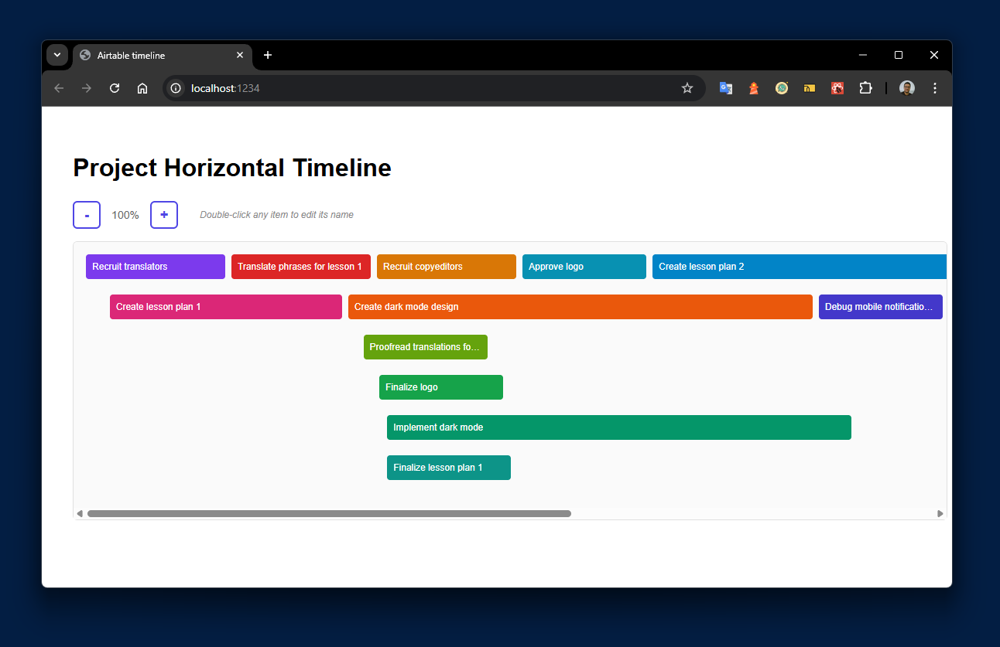
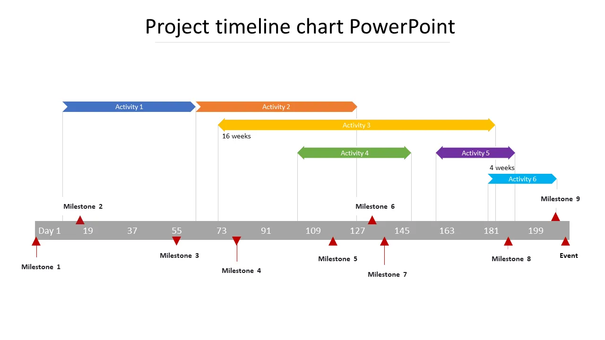

# React Horizontal Timeline

A responsive horizontal timeline component built with React.  
Designed as part of a frontend technical challenge for a remote engineering role.

## Preview



## Features

- **Horizontal Timeline Layout**: Clean, responsive timeline with events positioned chronologically
- **Smart Lane Management**: Automatically groups overlapping events into separate lanes to prevent visual conflicts
- **Interactive Navigation**: Smooth scrolling with zoom controls and drag-to-pan functionality
- **Responsive Design**: Adapts to different screen sizes while maintaining readability
- **Event Details**: Click events to view detailed information in an overlay
- **Custom Styling**: Clean, modern UI with hover effects and smooth transitions
- **Accessible**: Keyboard navigation and screen reader support

## Installation

```bash
npm install
# or
yarn install
```

## Quick Start

```bash
npm start
# or
yarn start
```

## Usage

```jsx
import Timeline from './components/Timeline';
import { timelineData } from './data/timelineData';

function App() {
    return <Timeline events={timelineData} />;
}
```

## What I Like About My Implementation

### Clean Architecture and Component Structure
- **Separation of Concerns**: Used custom hooks (`useZoom`, `useTimelineItems`) to separate business logic from UI components
- **Modular Design**: Each component has a single responsibility - `ZoomControls`, `TimelineContainer`, `TimelineItem` 
- **Reusable Utilities**: Created utility modules for colors (`colorUtils.js`) and accessibility (`a11yUtils.js`)

### User Experience Features
- **Inline Editing**: Double-click any timeline item to edit its name with full keyboard support
- **Visual Feedback**: Each item has its own unique color from a carefully selected palette
- **Zoom Functionality**: Smooth zoom in/out controls with visual percentage indicator
- **Responsive Container**: Horizontal scroll when content exceeds viewport width

### Accessibility Implementation
- **Full Keyboard Navigation**: Tab navigation, Enter/Space activation, Escape to cancel
- **Screen Reader Support**: ARIA labels, roles, and live regions for dynamic content
- **Focus Management**: Clear visual focus indicators and logical tab order
- **Semantic HTML**: Proper heading hierarchy and landmark elements

### CSS Organization
- **Clean Separation**: Moved all inline styles to organized CSS classes
- **Modern CSS**: Used Flexbox, CSS custom properties, and smooth transitions
- **Hover States**: Subtle elevation effects and brightness adjustments

## What I Would Change If I Were Going to Do It Again

### Performance Optimizations
- **React.memo**: Memoize `TimelineItem` components to prevent unnecessary re-renders
- **Virtual Scrolling**: For large datasets (1000+ items), implement windowing
- **Debounced Zoom**: Debounce zoom calculations to improve performance during rapid changes

### Enhanced Features
- **Drag & Drop**: Allow users to drag timeline items to change their dates
- **Date Range Selection**: Click and drag to select multiple items
- **Export Functionality**: Export timeline as image or PDF
- **Theme System**: Support for light/dark themes and custom color schemes

### Better State Management
- **Context API**: For larger applications, move shared state to React Context
- **Undo/Redo**: Implement command pattern for edit operations
- **Persistence**: Save timeline state to localStorage or backend

### Testing Infrastructure
- **Component Testing**: More comprehensive unit tests for each component
- **Integration Tests**: Test component interactions and data flow
- **Visual Regression**: Automated screenshot testing for UI consistency

## How I Made My Design Decisions

### Visual Inspiration
I used **46287-project-timeline-chart-powerpoint-1280.webp** as the primary design inspiration. This PowerPoint timeline chart provided:


- **Horizontal Lane Layout**: Clean separation of concurrent events
- **Color Coding**: Each item with distinct background colors for easy identification  
- **Minimal Design**: Focus on content with clean typography and spacing
- **Professional Appearance**: Business-ready aesthetic suitable for project management

### Technical Decisions
- **React Hooks**: Chose hooks over class components for better code reuse and testability
- **CSS-in-CSS**: Preferred external stylesheets over CSS-in-JS for easier maintenance
- **Percentage-based Positioning**: Used percentages for responsive timeline scaling
- **Custom Hooks**: Extracted zoom and item management logic for reusability

### Accessibility First
- **WCAG Guidelines**: Followed Web Content Accessibility Guidelines from the start
- **Keyboard Navigation**: Designed interaction patterns to work without a mouse
- **Screen Reader Testing**: Considered screen reader users in all component designs

## How I Would Test This If I Had More Time

### Unit Testing with Jest
```javascript
// Component unit tests
describe('TimelineItem', () => {
  it('should render item name and duration', () => {
    // Test basic rendering
  });
  
  it('should enter edit mode on double-click', () => {
    // Test interaction behavior
  });
  
  it('should save changes on Enter key', () => {
    // Test keyboard interactions
  });
});

// Hook testing
describe('useZoom', () => {
  it('should increment zoom level within bounds', () => {
    // Test zoom logic
  });
});
```

### Integration Testing
- **Timeline Rendering**: Test that items are positioned correctly based on dates
- **Lane Assignment**: Verify that overlapping items are assigned to different lanes
- **Color Assignment**: Ensure each item gets a unique, consistent color
- **Edit Flow**: Test complete edit cycle from activation to saving

### Accessibility Testing
- **Keyboard Navigation**: Automated tests for tab order and keyboard shortcuts
- **Screen Reader**: Test with tools like aXe-core for ARIA compliance
- **Focus Management**: Ensure focus moves logically through the interface

### Performance Testing
- **Large Datasets**: Test with 100, 500, 1000+ timeline items
- **Memory Leaks**: Check for memory leaks during zoom operations
- **Render Performance**: Measure component render times

### Visual Regression Testing
- **Screenshot Comparison**: Use tools like Chromatic or Percy
- **Cross-browser**: Test rendering consistency across browsers
- **Responsive Design**: Test at various screen sizes

### End-to-End Testing
```javascript
// Cypress E2E tests
describe('Timeline Application', () => {
  it('should zoom in and out smoothly', () => {
    // Test zoom functionality
  });
  
  it('should edit item names inline', () => {
    // Test complete edit workflow  
  });
  
  it('should be accessible via keyboard only', () => {
    // Test full keyboard navigation
  });
});
```

